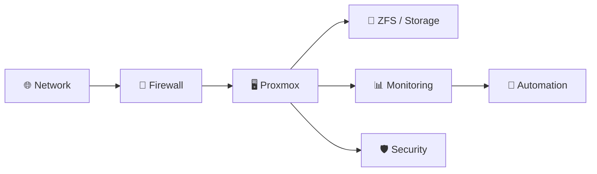

# Patrick Emanuel Hirt Rauch

### DevOps & Infrastructure Engineer

**Linux • Virtualization • Networking • Security • Automation • Data Center**

Construo e opero infraestrutura de TI, atuando desde **servidores e virtualização até redes, segurança, automação, monitoramento e infraestrutura física**.

---

## 🧩 Core Skills

| Área                  | Tecnologias / Conhecimentos                            |
| --------------------- | ------------------------------------------------------ |
| 🐧 **Linux**          | Debian · Ubuntu · Arch · Shell · System Administration |
| 🖥️ **Virtualização** | Proxmox VE · Clusters · ZFS                            |
| 🌐 **Networking**     | MikroTik · Cisco · VLAN · Routing · DNS · VPN          |
| 🔐 **Security**       | Sophos · Wazuh · Suricata · SIEM · Firewall            |
| 🤖 **Automation**     | Bash · Python · n8n · Node-RED · Home Assistant        |
| 📊 **Monitoring**     | Prometheus · Grafana · Uptime Kuma · Logs              |
| 💾 **Storage**        | ZFS · Backup · Replication · NAS                       |
| ⚡ **Infrastructure**  | UPS · BMS · Energy Monitoring · Power Systems          |
| 🐳 **Containers**     | Docker · Docker Compose                                |
| 🌍 **Web / DevOps**   | CI/CD · APIs · Next.js · JavaScript · TypeScript       |

---

## 🏗️ Infrastructure



**Do projeto à operação:** infraestrutura física → redes → virtualização → serviços → segurança → monitoramento → automação.

---

## 🚀 Featured

| Projeto                        | Descrição                                       |
| ------------------------------ | ----------------------------------------------- |
| 📡 **AIC8800 Linux Installer** | Driver, firmware, DKMS e diagnóstico para Linux |
| 🖥️ **Infrastructure Lab**     | Virtualização, redes, storage e segurança       |
| 🌐 **Network Infrastructure**  | MikroTik, VLANs, routing, firewall e DNS        |
| 📊 **Monitoring & Security**   | Observabilidade, SIEM, logs e alertas           |
| 🤖 **Automation**              | n8n, Node-RED, APIs e automação operacional     |

🔗 **[Portfólio & documentação](https://patrickhirtrauch.com/)**

---

## ⚙️ Technology Stack

```text
Linux          Debian · Ubuntu · Arch
Virtualization Proxmox VE · ZFS
Networking     MikroTik · Cisco · VLAN · DNS · VPN
Security       Sophos · Wazuh · Suricata
Automation     Bash · Python · n8n · Node-RED
Monitoring     Prometheus · Grafana · Uptime Kuma
Storage        ZFS · Backup · Replication
Containers     Docker · Docker Compose
Development    JavaScript · TypeScript · Next.js · APIs
```

---

### 🌐

**[patrickhirtrauch.com](https://patrickhirtrauch.com/)**
